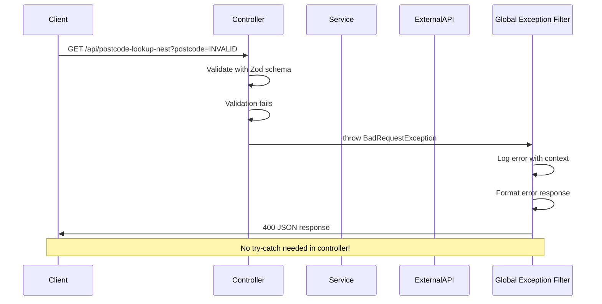
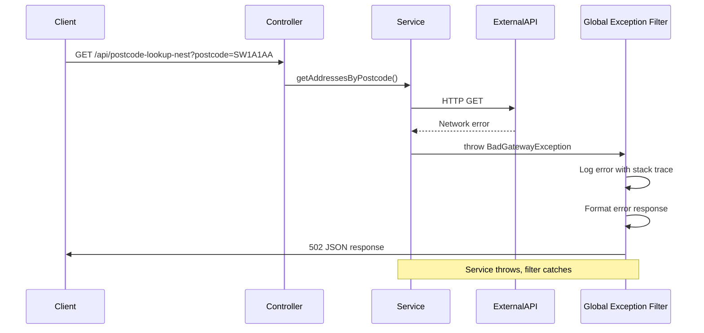

# Global Exception Filter Guide

## Overview

The **Global Exception Filter** is a centralized error handling mechanism in NestJS that catches all exceptions across the entire application. It provides consistent error responses, centralized logging, and eliminates the need for scattered try-catch blocks in controllers.

**Location:** `src/main/nest/filters/all-exceptions.filter.ts`

---

## How It Works

### 1. Automatic Exception Catching

The filter uses the `@Catch()` decorator without arguments, which means it catches **ALL** exceptions:

```typescript
@Catch()
export class AllExceptionsFilter implements ExceptionFilter {
  catch(exception: unknown, host: ArgumentsHost): void {
    // Handle any exception thrown anywhere in the app
  }
}
```

### 2. Global Registration

The filter is registered globally in `AppModule` using the `APP_FILTER` token:

```typescript
@Module({
  providers: [
    {
      provide: APP_FILTER,
      useClass: AllExceptionsFilter,
    },
  ],
})
export class AppModule {}
```

This means:
- ✅ Applied to **all controllers** automatically
- ✅ No need to register on individual routes
- ✅ Works across all NestJS modules
- ✅ Catches exceptions from services, guards, interceptors, etc.

### 3. Smart Response Handling

The filter detects the type of request and responds appropriately:

**For HTML Routes (Journeys):**
```typescript
if (request.url.startsWith('/nest-journey') || request.url.startsWith('/respond-to-claim')) {
  response.status(status).render('error.njk', {
    statusCode: status,
    message,
    backUrl: '/dashboard',
  });
}
```

**For API Routes:**
```typescript
response.status(status).json({
  statusCode: status,
  timestamp: new Date().toISOString(),
  path: request.url,
  message,
});
```

---

## Benefits

### 1. Clean Controllers - No Try-Catch Boilerplate

**Without Global Exception Filter (Express Pattern):**
```typescript
app.get('/api/postcode', async (req, res) => {
  try {
    const result = await postcodeService.lookup(req.query.postcode);
    res.json(result);
  } catch (error) {
    console.error('Error:', error);
    res.status(500).json({ error: 'Internal server error' });
  }
});
```

**With Global Exception Filter (NestJS Pattern):**
```typescript
@Get('postcode-lookup-nest')
async lookup(@Query() query: Record<string, unknown>): Promise<{ addresses: unknown[] }> {
  const result = PostcodeLookupSchema.safeParse(query);

  if (!result.success) {
    throw new BadRequestException({ error: 'Invalid postcode' }); // ← Automatically caught!
  }

  const addresses = await this.postcodeService.getAddressesByPostcode(dto.postcode);
  return { addresses }; // ← No try-catch needed!
}
```

**Result:**
- ✅ Controllers focus on HTTP routing and request/response handling
- ✅ Services focus on business logic without error handling boilerplate
- ✅ No repetitive error handling code in either layer
- ✅ Consistent error responses across all routes

---

### 2. Centralized Logging

All exceptions are logged in one place with consistent formatting:

```typescript
this.logger.error('Exception caught', {
  url: request.url,
  method: request.method,
  userAgent: request.get('User-Agent'),
  error: exception instanceof Error ? exception.stack : exception,
});
```

**Benefits:**
- ✅ Single source of truth for error logging
- ✅ Consistent log format across the application
- ✅ Easy to integrate with monitoring tools (e.g., Sentry, DataDog)
- ✅ Includes request context (URL, method, user agent)
- ✅ Full error stack traces for debugging

---

### 3. Consistent Error Responses

The filter ensures all errors follow the same format:

**API Error Response:**
```json
{
  "statusCode": 400,
  "timestamp": "2025-01-30T15:53:00.000Z",
  "path": "/api/postcode-lookup-nest",
  "message": "Invalid postcode"
}
```

**Benefits:**
- ✅ Frontend developers know what to expect
- ✅ Easy to parse and display errors
- ✅ Includes timestamp for debugging
- ✅ Includes request path for context

---

### 4. Type-Safe Error Handling

The filter handles different exception types safely:

```typescript
// Determine error message
let message: string;
if (exception instanceof HttpException) {
  const exceptionResponse = exception.getResponse();
  message = typeof exceptionResponse === 'string' 
    ? exceptionResponse 
    : (exceptionResponse as { message?: string }).message || exception.message;
} else if (exception instanceof Error) {
  message = exception.message;
} else {
  message = 'Internal server error';
}
```

**Handles:**
- ✅ NestJS `HttpException` (BadRequestException, NotFoundException, etc.)
- ✅ Standard JavaScript `Error` objects
- ✅ Unknown exceptions (fallback to generic message)

---

### 5. User-Friendly Error Pages

For HTML routes (journeys), the filter renders a user-friendly error page:

```typescript
response.status(status).render('error.njk', {
  statusCode: status,
  message,
  backUrl: '/dashboard',
});
```

**Benefits:**
- ✅ Users see friendly error messages, not stack traces
- ✅ Includes back button to navigate away
- ✅ Follows GOV.UK Design System patterns
- ✅ Maintains consistent user experience

---

## Exception Types and Status Codes

The filter automatically determines the HTTP status code:

```typescript
const status = exception instanceof HttpException 
  ? exception.getStatus() 
  : HttpStatus.INTERNAL_SERVER_ERROR;
```

### Common NestJS Exceptions

| Exception | Status Code | Use Case |
|-----------|-------------|----------|
| `BadRequestException` | 400 | Invalid input data |
| `UnauthorizedException` | 401 | User not authenticated |
| `ForbiddenException` | 403 | User not authorized |
| `NotFoundException` | 404 | Resource not found |
| `ConflictException` | 409 | Resource conflict |
| `BadGatewayException` | 502 | External API failure |
| `InternalServerErrorException` | 500 | Unexpected errors |

### Usage in Services

Services can throw typed exceptions that the filter will handle:

```typescript
@Injectable()
export class PostcodeService {
  async getAddressesByPostcode(postcode: string): Promise<Address[]> {
    try {
      const response = await axios.get(apiUrl);
      return response.data.results;
    } catch (error) {
      this.logger.error('Error fetching addresses from OS Places API', error);
      throw new BadGatewayException('Failed to lookup postcode'); // ← Caught by filter
    }
  }
}
```

---

## How Exceptions Flow Through the Application

### Request Flow with Exception



### Service Exception Flow



---

## Comparison: Express vs NestJS Error Handling

### Express (Current Pattern)

**Problems:**
- ❌ Error handling scattered across routes
- ❌ Inconsistent error responses
- ❌ Repetitive try-catch blocks
- ❌ Easy to forget error handling
- ❌ No centralized logging

**Example:**
```typescript
app.get('/api/postcode', async (req, res) => {
  try {
    if (!req.query.postcode) {
      return res.status(400).json({ error: 'Postcode required' });
    }
    const result = await service.lookup(req.query.postcode);
    res.json(result);
  } catch (error) {
    console.error(error);
    res.status(500).json({ error: 'Something went wrong' });
  }
});

app.get('/api/addresses', async (req, res) => {
  try {
    // Different error handling pattern
    const result = await service.getAddresses();
    res.json(result);
  } catch (error) {
    // Different error format
    res.status(500).send('Error');
  }
});
```

### NestJS (With Global Exception Filter)

**Benefits:**
- ✅ Centralized error handling
- ✅ Consistent error responses
- ✅ No try-catch boilerplate
- ✅ Impossible to forget error handling
- ✅ Centralized logging

**Example:**
```typescript
@Controller('api')
export class PostcodeController {
  @Get('postcode-lookup-nest')
  async lookup(@Query() query: Record<string, unknown>) {
    const result = PostcodeLookupSchema.safeParse(query);
    if (!result.success) {
      throw new BadRequestException('Invalid postcode'); // ← Caught by filter
    }
    return await this.postcodeService.getAddressesByPostcode(result.data.postcode);
  }
}

@Controller('api')
export class AddressController {
  @Get('addresses')
  async getAddresses() {
    // No try-catch needed - filter handles all errors
    return await this.addressService.getAll();
  }
}
```

---

## Testing with Global Exception Filter

The filter makes testing easier because you can test error scenarios without mocking error handling:

```typescript
describe('PostcodeController', () => {
  it('should throw BadRequestException for invalid postcode', async () => {
    const query = { postcode: 'INVALID' };
    
    await expect(controller.lookup(query)).rejects.toThrow(BadRequestException);
    // Filter will catch this in production
  });
  
  it('should throw BadGatewayException when service fails', async () => {
    jest.spyOn(postcodeService, 'getAddressesByPostcode')
      .mockRejectedValue(new Error('API down'));
    
    await expect(controller.lookup({ postcode: 'SW1A1AA' }))
      .rejects.toThrow();
    // Filter will catch and convert to 502 response
  });
});
```

---

## Best Practices

### 1. Use Typed Exceptions

Always use NestJS's built-in exception classes:

```typescript
// ✅ Good - Typed exception
throw new BadRequestException('Invalid postcode format');

// ❌ Bad - Generic error
throw new Error('Invalid postcode format');
```

### 2. Provide Meaningful Error Messages

```typescript
// ✅ Good - Clear, actionable message
throw new BadRequestException('Postcode must be in format: SW1A 1AA');

// ❌ Bad - Vague message
throw new BadRequestException('Invalid input');
```

### 3. Include Context in Service Errors

```typescript
// ✅ Good - Logs context before throwing
this.logger.error('Failed to fetch addresses', { postcode, error });
throw new BadGatewayException('Failed to lookup postcode');

// ❌ Bad - No context
throw new BadGatewayException('Error');
```

### 4. Don't Catch Exceptions in Controllers

Let the global filter handle them:

```typescript
// ✅ Good - Let filter catch
@Get('postcode')
async lookup(@Query('postcode') postcode: string) {
  return await this.service.lookup(postcode);
}

// ❌ Bad - Unnecessary try-catch
@Get('postcode')
async lookup(@Query('postcode') postcode: string) {
  try {
    return await this.service.lookup(postcode);
  } catch (error) {
    throw new BadGatewayException('Failed');
  }
}
```

---

## Extending the Filter

You can customize the filter for specific needs:

### Add Request ID for Tracing

```typescript
catch(exception: unknown, host: ArgumentsHost): void {
  const ctx = host.switchToHttp();
  const request = ctx.getRequest<Request>();
  const requestId = request.headers['x-request-id'] || uuid();
  
  this.logger.error('Exception caught', {
    requestId,
    url: request.url,
    error: exception,
  });
  
  response.status(status).json({
    statusCode: status,
    requestId, // ← Include in response
    message,
  });
}
```

### Integrate with Monitoring Tools

```typescript
catch(exception: unknown, host: ArgumentsHost): void {
  // Log to monitoring service
  Sentry.captureException(exception);
  
  // Continue with normal error handling
  // ...
}
```

### Add Custom Error Codes

```typescript
response.status(status).json({
  statusCode: status,
  errorCode: this.getErrorCode(exception), // ← Custom error codes
  message,
});
```

---

## Summary

### Key Takeaways

1. **Centralized Error Handling** - One place for all exceptions
2. **Clean Controllers** - No try-catch boilerplate needed
3. **Consistent Responses** - Same format for all errors
4. **Centralized Logging** - Easy monitoring and debugging
5. **Type-Safe** - Handles all exception types safely
6. **User-Friendly** - Different responses for HTML vs API routes

### Files

- **Filter:** `src/main/nest/filters/all-exceptions.filter.ts`
- **Registration:** `src/main/nest/app.module.ts`
- **Usage:** All controllers automatically protected

### Related Documentation

- [NestJS Exception Filters](https://docs.nestjs.com/exception-filters)
- [NestJS HTTP Exceptions](https://docs.nestjs.com/exception-filters#built-in-http-exceptions)
- [Error Handling Best Practices](./NESTJS_JOURNEY_IMPLEMENTATION_GUIDE.md#error-handling)
