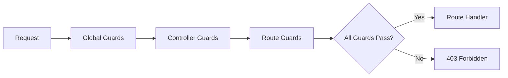

# NestJS Authorization & Role-Based Access Control Guide

## Overview

NestJS provides built-in support for authorization through **Guards** - a powerful, declarative way to handle user roles, permissions, and access control. This guide demonstrates how NestJS handles authorization compared to Express middleware patterns.

---

## How NestJS Handles User Roles

### **1. Guards - The Core Authorization Mechanism**

Guards are classes that implement the `CanActivate` interface and determine whether a request should be handled by the route handler.

**Key Benefits:**
- ✅ Declarative authorization with decorators
- ✅ Reusable across controllers and routes
- ✅ Type-safe with TypeScript
- ✅ Testable in isolation
- ✅ Can be applied at global, controller, or route level

---

## Architecture: Express vs NestJS

### **Express Pattern (Current)**

```typescript
// Middleware-based authorization
function requireRole(role: string) {
  return (req: Request, res: Response, next: NextFunction) => {
    if (!req.user || !req.user.roles.includes(role)) {
      return res.status(403).json({ error: 'Forbidden' });
    }
    next();
  };
}

// Usage - must remember to add middleware
app.get('/admin/users', requireRole('admin'), (req, res) => {
  // Handler
});

app.get('/admin/reports', requireRole('admin'), (req, res) => {
  // Handler - easy to forget middleware
});
```

**Problems:**
- ❌ Easy to forget middleware on routes
- ❌ No compile-time checking
- ❌ Inconsistent error responses
- ❌ Hard to test in isolation
- ❌ Scattered authorization logic

---

### **NestJS Pattern (Guards + Decorators)**

```typescript
// Guard implementation
@Injectable()
export class RolesGuard implements CanActivate {
  constructor(private reflector: Reflector) {}

  canActivate(context: ExecutionContext): boolean {
    const requiredRoles = this.reflector.getAllAndOverride<string[]>('roles', [
      context.getHandler(),
      context.getClass(),
    ]);

    if (!requiredRoles) {
      return true;
    }

    const request = context.switchToHttp().getRequest();
    const user = request.user;

    return requiredRoles.some((role) => user.roles?.includes(role));
  }
}

// Custom decorator
export const Roles = (...roles: string[]) => SetMetadata('roles', roles);

// Usage - declarative and type-safe
@Controller('admin')
@UseGuards(RolesGuard)
export class AdminController {
  
  @Get('users')
  @Roles('admin', 'superadmin')
  getAllUsers() {
    // Only accessible by admin or superadmin
  }

  @Get('reports')
  @Roles('admin')
  getReports() {
    // Only accessible by admin
  }
}
```

**Benefits:**
- ✅ Impossible to forget authorization (guard is on controller)
- ✅ Compile-time type checking
- ✅ Consistent error responses (via exception filters)
- ✅ Easy to test with DI mocking
- ✅ Centralized authorization logic

---

## Implementation Examples

### **1. Basic Role Guard**

**File:** `src/main/nest/guards/roles.guard.ts`

```typescript
import { CanActivate, ExecutionContext, Injectable } from '@nestjs/common';
import { Reflector } from '@nestjs/core';
import type { Request } from 'express';

export const ROLES_KEY = 'roles';

interface RequestWithUser extends Request {
  user?: {
    roles?: string[];
    id?: string;
    email?: string;
  };
}

@Injectable()
export class RolesGuard implements CanActivate {
  constructor(private reflector: Reflector) {}

  canActivate(context: ExecutionContext): boolean {
    const requiredRoles = this.reflector.getAllAndOverride<string[]>(ROLES_KEY, [
      context.getHandler(),
      context.getClass(),
    ]);

    if (!requiredRoles) {
      return true; // No roles required, allow access
    }

    const request = context.switchToHttp().getRequest<RequestWithUser>();
    const user = request.user;

    if (!user || !user.roles) {
      return false; // No user or no roles, deny access
    }

    return requiredRoles.some((role) => user.roles?.includes(role));
  }
}
```

---

### **2. Roles Decorator**

**File:** `src/main/nest/decorators/roles.decorator.ts`

```typescript
import { SetMetadata } from '@nestjs/common';

import { ROLES_KEY } from '../guards/roles.guard';

export const Roles = (...roles: string[]): ReturnType<typeof SetMetadata> => 
  SetMetadata(ROLES_KEY, roles);
```

---

### **3. Usage in Controllers**

#### **Controller-Level Authorization**

```typescript
@Controller('admin')
@UseGuards(OidcGuard, RolesGuard) // Apply to all routes
@Roles('admin')
export class AdminController {
  
  @Get('dashboard')
  getDashboard() {
    // All routes require 'admin' role
  }

  @Get('users')
  getUsers() {
    // Also requires 'admin' role
  }
}
```

#### **Route-Level Authorization**

```typescript
@Controller('dashboard')
@UseGuards(OidcGuard) // Authentication required
export class DashboardController {
  
  @Get()
  getDashboard() {
    // Any authenticated user can access
  }

  @Get('admin-panel')
  @UseGuards(RolesGuard)
  @Roles('admin')
  getAdminPanel() {
    // Only admins can access
  }

  @Get('reports')
  @UseGuards(RolesGuard)
  @Roles('admin', 'manager')
  getReports() {
    // Admins or managers can access
  }
}
```

#### **Multiple Roles**

```typescript
@Controller('reports')
@UseGuards(OidcGuard, RolesGuard)
export class ReportsController {
  
  @Get('financial')
  @Roles('admin', 'finance')
  getFinancialReports() {
    // Accessible by admin OR finance role
  }

  @Get('sensitive')
  @Roles('superadmin')
  getSensitiveReports() {
    // Only superadmin can access
  }
}
```

---

## Guard Execution Order

Guards execute in a specific order:



**Example:**

```typescript
// Global guard (in main.ts or app.module.ts)
app.useGlobalGuards(new OidcGuard());

// Controller guard
@Controller('admin')
@UseGuards(RolesGuard)
@Roles('admin')
export class AdminController {
  
  // Route guard
  @Get('sensitive')
  @UseGuards(IpWhitelistGuard)
  getSensitiveData() {
    // Execution order:
    // 1. OidcGuard (global) - checks authentication
    // 2. RolesGuard (controller) - checks admin role
    // 3. IpWhitelistGuard (route) - checks IP whitelist
  }
}
```

---

## Advanced Authorization Patterns

### **1. Permission-Based Authorization**

```typescript
// Permission guard
@Injectable()
export class PermissionsGuard implements CanActivate {
  constructor(private reflector: Reflector) {}

  canActivate(context: ExecutionContext): boolean {
    const requiredPermissions = this.reflector.get<string[]>(
      'permissions',
      context.getHandler()
    );

    if (!requiredPermissions) {
      return true;
    }

    const request = context.switchToHttp().getRequest();
    const user = request.user;

    return requiredPermissions.every((permission) =>
      user.permissions?.includes(permission)
    );
  }
}

// Permission decorator
export const RequirePermissions = (...permissions: string[]) =>
  SetMetadata('permissions', permissions);

// Usage
@Controller('documents')
export class DocumentsController {
  
  @Get()
  @RequirePermissions('documents:read')
  getDocuments() {}

  @Post()
  @RequirePermissions('documents:create')
  createDocument() {}

  @Delete(':id')
  @RequirePermissions('documents:delete')
  deleteDocument() {}
}
```

---

### **2. Resource-Based Authorization**

```typescript
// Owner guard - checks if user owns the resource
@Injectable()
export class OwnerGuard implements CanActivate {
  constructor(private documentsService: DocumentsService) {}

  async canActivate(context: ExecutionContext): Promise<boolean> {
    const request = context.switchToHttp().getRequest();
    const user = request.user;
    const documentId = request.params.id;

    const document = await this.documentsService.findOne(documentId);
    
    return document.ownerId === user.id;
  }
}

// Usage
@Controller('documents')
export class DocumentsController {
  
  @Get(':id')
  @UseGuards(OwnerGuard)
  getDocument(@Param('id') id: string) {
    // Only the owner can access their document
  }
}
```

---

### **3. Combining Multiple Guards**

```typescript
@Controller('sensitive-data')
@UseGuards(OidcGuard, RolesGuard, IpWhitelistGuard)
@Roles('admin')
export class SensitiveDataController {
  
  @Get()
  getSensitiveData() {
    // Must pass:
    // 1. Authentication (OidcGuard)
    // 2. Admin role (RolesGuard)
    // 3. IP whitelist (IpWhitelistGuard)
  }
}
```

---

## Testing Guards

### **Unit Testing**

```typescript
describe('RolesGuard', () => {
  let guard: RolesGuard;
  let reflector: Reflector;

  beforeEach(() => {
    reflector = new Reflector();
    guard = new RolesGuard(reflector);
  });

  it('should allow access when no roles are required', () => {
    jest.spyOn(reflector, 'getAllAndOverride').mockReturnValue(undefined);

    const context = createMockExecutionContext();
    expect(guard.canActivate(context)).toBe(true);
  });

  it('should deny access when user has no roles', () => {
    jest.spyOn(reflector, 'getAllAndOverride').mockReturnValue(['admin']);

    const context = createMockExecutionContext({ user: {} });
    expect(guard.canActivate(context)).toBe(false);
  });

  it('should allow access when user has required role', () => {
    jest.spyOn(reflector, 'getAllAndOverride').mockReturnValue(['admin']);

    const context = createMockExecutionContext({
      user: { roles: ['admin'] }
    });
    expect(guard.canActivate(context)).toBe(true);
  });
});
```

### **Integration Testing**

```typescript
describe('AdminController', () => {
  let app: INestApplication;

  beforeEach(async () => {
    const module = await Test.createTestingModule({
      controllers: [AdminController],
      providers: [RolesGuard, Reflector],
    }).compile();

    app = module.createNestApplication();
    await app.init();
  });

  it('should deny access without admin role', () => {
    return request(app.getHttpServer())
      .get('/admin/users')
      .expect(403);
  });

  it('should allow access with admin role', () => {
    // Mock authentication with admin role
    return request(app.getHttpServer())
      .get('/admin/users')
      .set('Authorization', 'Bearer admin-token')
      .expect(200);
  });
});
```

---

## Error Handling with Guards

Guards throw exceptions that are caught by the global exception filter:

```typescript
@Injectable()
export class RolesGuard implements CanActivate {
  canActivate(context: ExecutionContext): boolean {
    const requiredRoles = this.reflector.getAllAndOverride<string[]>('roles', [
      context.getHandler(),
      context.getClass(),
    ]);

    if (!requiredRoles) {
      return true;
    }

    const request = context.switchToHttp().getRequest();
    const user = request.user;

    if (!user) {
      throw new UnauthorizedException('User not authenticated');
    }

    if (!user.roles || !requiredRoles.some((role) => user.roles.includes(role))) {
      throw new ForbiddenException('Insufficient permissions');
    }

    return true;
  }
}
```

**Error Responses (via Global Exception Filter):**

```json
// 401 Unauthorized
{
  "statusCode": 401,
  "timestamp": "2026-02-02T08:00:00.000Z",
  "path": "/admin/users",
  "message": "User not authenticated"
}

// 403 Forbidden
{
  "statusCode": 403,
  "timestamp": "2026-02-02T08:00:00.000Z",
  "path": "/admin/users",
  "message": "Insufficient permissions"
}
```

---

## Real-World Example: Your Current Implementation

### **OIDC Authentication Guard**

**File:** `src/main/nest/guards/oidc.guard.ts`

```typescript
@Injectable()
export class OidcGuard implements CanActivate {
  async canActivate(context: ExecutionContext): Promise<boolean> {
    const request = context.switchToHttp().getRequest();
    const response = context.switchToHttp().getResponse();

    return new Promise((resolve, reject) => {
      oidcMiddleware(request, response, (err?: unknown) => {
        if (err) {
          reject(new UnauthorizedException('Authentication required'));
        } else {
          resolve(true);
        }
      });
    });
  }
}
```

### **Usage in Your Controllers**

```typescript
// Postcode API - requires authentication
@Controller('api')
@UseGuards(OidcGuard)
export class PostcodeController {
  @Get('postcode-lookup-nest')
  async lookup(@Query() query: Record<string, unknown>) {
    // Only authenticated users can access
  }
}

// Journey - requires authentication
@Controller('nest-journey')
@UseGuards(OidcGuard)
export class NestJourneyController {
  @Get('step1')
  async getStep1() {
    // Only authenticated users can access
  }
}
```

---

## Comparison Summary

| Aspect | Express Middleware | NestJS Guards |
|--------|-------------------|---------------|
| **Declaration** | Function-based | Class-based with decorators |
| **Reusability** | Must import and apply manually | Automatic via decorators |
| **Type Safety** | No compile-time checking | Full TypeScript support |
| **Testing** | Complex mocking | Simple DI mocking |
| **Error Handling** | Manual in each middleware | Automatic via exception filters |
| **Consistency** | Easy to forget or apply incorrectly | Enforced by decorators |
| **Readability** | Scattered across routes | Clear at controller/route level |
| **Dependency Injection** | Manual | Automatic via constructor |

---

## Best Practices

### **1. Combine Guards for Layered Security**

```typescript
@Controller('admin')
@UseGuards(OidcGuard, RolesGuard, IpWhitelistGuard)
@Roles('admin')
export class AdminController {
  // All routes protected by multiple guards
}
```

### **2. Use Descriptive Guard Names**

```typescript
// ✅ Good
@UseGuards(AdminRoleGuard)
@UseGuards(EmailVerifiedGuard)

// ❌ Bad
@UseGuards(Guard1)
@UseGuards(CheckGuard)
```

### **3. Throw Appropriate Exceptions**

```typescript
// ✅ Good - specific exceptions
if (!user) {
  throw new UnauthorizedException('User not authenticated');
}
if (!hasRole) {
  throw new ForbiddenException('Insufficient permissions');
}

// ❌ Bad - generic exception
if (!user || !hasRole) {
  throw new Error('Access denied');
}
```

### **4. Test Guards in Isolation**

```typescript
// ✅ Good - unit test the guard logic
describe('RolesGuard', () => {
  it('should allow access with correct role', () => {
    // Test guard logic
  });
});

// ✅ Good - integration test with controller
describe('AdminController', () => {
  it('should deny access without admin role', () => {
    // Test full request flow
  });
});
```

---

## Migration Path from Express

### **Step 1: Create Guards**

Replace Express middleware with NestJS guards:

```typescript
// Before (Express)
function requireAdmin(req, res, next) {
  if (!req.user?.roles.includes('admin')) {
    return res.status(403).json({ error: 'Forbidden' });
  }
  next();
}

// After (NestJS)
@Injectable()
export class AdminGuard implements CanActivate {
  canActivate(context: ExecutionContext): boolean {
    const request = context.switchToHttp().getRequest();
    return request.user?.roles.includes('admin');
  }
}
```

### **Step 2: Apply Guards to Controllers**

```typescript
// Before (Express)
app.get('/admin/users', requireAdmin, (req, res) => {});

// After (NestJS)
@Controller('admin')
@UseGuards(AdminGuard)
export class AdminController {
  @Get('users')
  getUsers() {}
}
```

### **Step 3: Add Custom Decorators**

```typescript
// Create reusable decorators
export const Roles = (...roles: string[]) => SetMetadata('roles', roles);

// Use in controllers
@Controller('admin')
@UseGuards(RolesGuard)
@Roles('admin', 'superadmin')
export class AdminController {}
```

---

## Summary

### **Key Takeaways**

1. **Guards are Classes** - Implement `CanActivate` interface
2. **Declarative Authorization** - Use decorators (`@UseGuards`, `@Roles`)
3. **Multiple Levels** - Apply at global, controller, or route level
4. **Type-Safe** - Full TypeScript support with compile-time checking
5. **Testable** - Easy to test with dependency injection
6. **Consistent Errors** - Exceptions caught by global filter

### **Files Created**

- **Guard:** `src/main/nest/guards/roles.guard.ts`
- **Decorator:** `src/main/nest/decorators/roles.decorator.ts`
- **Existing:** `src/main/nest/guards/oidc.guard.ts`

### **Related Documentation**

- [Global Exception Filter Guide](./GLOBAL_EXCEPTION_FILTER_GUIDE.md)
- [NestJS Dependency Injection Guide](./NESTJS_DEPENDENCY_INJECTION_GUIDE.md)
- [NestJS Guards Documentation](https://docs.nestjs.com/guards)
