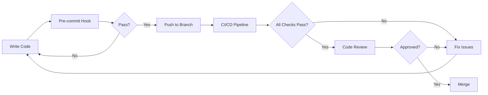

# NestJS Guardrail Enforcement Strategy

## Overview

While NestJS encourages architectural patterns through its framework design, it cannot automatically enforce them. This document outlines tools and strategies to **enforce** (not just encourage) NestJS best practices throughout the development lifecycle.

---

## Table of Contents

1. [What Are "Guardrails"?](#what-are-guardrails)
2. [Enforcement Tools](#enforcement-tools)
3. [Implementation Strategy](#implementation-strategy)
4. [CI/CD Integration](#cicd-integration)
5. [Team Adoption](#team-adoption)

---

## What Are "Guardrails"?

### Architectural Guardrails (Framework Patterns)

These are structural patterns that guide developers toward best practices:

- **Module System**: Forces separation of concerns and feature isolation
- **Dependency Injection**: Prevents tight coupling, encourages testability
- **DTOs with Zod/class-validator**: Type-safe validation and data contracts
- **Decorators**: Declarative, self-documenting code
- **TypeScript-first**: Compile-time type checking

### Guards (Executable Middleware)

These are actual classes that control access and behavior:

- `@UseGuards(OidcGuard)`: Authentication guard
- `@UseGuards(RolesGuard)`: Authorization guard
- Custom guards for business logic validation

**Key Distinction:** Architectural guardrails are patterns; Guards are code that executes at runtime.

---

## Enforcement Tools

### 1. ESLint Rules (Compile-Time Enforcement)

**Purpose:** Catch architectural violations during development and in CI/CD.

#### Recommended Rules

```javascript
// .eslintrc.js
module.exports = {
  extends: [
    'plugin:@typescript-eslint/recommended',
    'plugin:@darraghor/nestjs-typed/recommended',
  ],
  rules: {
    // Enforce thin controllers
    '@typescript-eslint/max-lines-per-function': ['error', { max: 50 }],
    'max-depth': ['error', 2],
    'complexity': ['error', 10],
    
    // Prevent business logic in controllers
    'max-lines': ['error', { max: 200, skipBlankLines: true }],
    
    // Enforce proper imports
    'no-restricted-imports': ['error', {
      patterns: ['../**/services/*'] // Prevent cross-module service imports
    }],
    
    // Enforce dependency injection
    '@typescript-eslint/no-explicit-any': 'error',
    '@typescript-eslint/explicit-function-return-type': 'warn',
  }
};
```

#### Custom ESLint Plugin

Create custom rules for NestJS-specific patterns:

```typescript
// eslint-plugin-local/rules/no-business-logic-in-controllers.js
module.exports = {
  meta: {
    type: 'problem',
    docs: {
      description: 'Disallow business logic in controllers',
    },
  },
  create(context) {
    return {
      MethodDefinition(node) {
        const filename = context.getFilename();
        if (!filename.endsWith('.controller.ts')) return;
        
        // Check for business logic keywords
        const sourceCode = context.getSourceCode().getText(node);
        const businessLogicPatterns = [
          /for\s*\(/,
          /while\s*\(/,
          /switch\s*\(/,
          /\.map\(/,
          /\.filter\(/,
          /\.reduce\(/,
        ];
        
        businessLogicPatterns.forEach(pattern => {
          if (pattern.test(sourceCode)) {
            context.report({
              node,
              message: 'Controllers should not contain business logic. Move to service.',
            });
          }
        });
      },
    };
  },
};
```

**Integration:**
```bash
# Run in CI/CD
npm run lint -- --max-warnings 0
```

---

### 2. SonarQube / SonarCloud (CI/CD Quality Gates)

**Purpose:** Enforce code quality standards and block PRs that violate rules.

#### Quality Gate Configuration

```yaml
# sonar-project.properties
sonar.projectKey=pcs-frontend
sonar.sources=src/main/nest
sonar.tests=src/test

# Quality Gate Thresholds
sonar.qualitygate.wait=true
sonar.coverage.exclusions=**/*.spec.ts,**/*.dto.ts

# Custom Rules
sonar.typescript.lcov.reportPaths=coverage/lcov.info
sonar.javascript.lcov.reportPaths=coverage/lcov.info
```

#### Enforce via Quality Gates

| Metric | Threshold | Purpose |
|--------|-----------|---------|
| **Cognitive Complexity** | ≤15 per method | Prevent complex logic in controllers |
| **Code Duplication** | ≤3% | Detect repeated validation (should be in DTOs) |
| **Method Length** | ≤30 lines | Controllers should be thin |
| **Class Size** | ≤300 lines | Services should be focused |
| **Code Coverage** | ≥80% | Ensure testability |

#### Custom SonarQube Rules

```xml
<!-- custom-rules.xml -->
<rule>
  <key>nestjs-controller-complexity</key>
  <name>NestJS Controller Complexity</name>
  <description>Controllers should not exceed complexity of 10</description>
  <severity>CRITICAL</severity>
  <tag>nestjs</tag>
  <tag>architecture</tag>
</rule>
```

**Integration:**
```bash
# Run in Jenkins/CI
npm run sonar
```

---

### 3. dependency-cruiser (Module Boundary Enforcement)

**Purpose:** Enforce module boundaries and prevent architectural violations.

#### Configuration

```javascript
// .dependency-cruiser.js
module.exports = {
  forbidden: [
    {
      name: 'no-circular-dependencies',
      severity: 'error',
      comment: 'Circular dependencies indicate poor architecture',
      from: {},
      to: { circular: true }
    },
    {
      name: 'controllers-must-not-import-other-controllers',
      severity: 'error',
      comment: 'Controllers should not depend on other controllers',
      from: { path: '**/*.controller.ts' },
      to: { path: '**/*.controller.ts' }
    },
    {
      name: 'services-must-not-import-controllers',
      severity: 'error',
      comment: 'Services should not depend on controllers',
      from: { path: '**/*.service.ts' },
      to: { path: '**/*.controller.ts' }
    },
    {
      name: 'no-cross-module-service-imports',
      severity: 'error',
      comment: 'Services should not import services from other modules directly',
      from: { path: 'src/main/nest/([^/]+)/.+\\.service\\.ts' },
      to: { 
        path: 'src/main/nest/([^/]+)/.+\\.service\\.ts',
        pathNot: '^src/main/nest/$1/'
      }
    },
    {
      name: 'dtos-must-be-pure',
      severity: 'error',
      comment: 'DTOs should not import services or controllers',
      from: { path: '**/dto/*.dto.ts' },
      to: { 
        path: '**/*.{service,controller}.ts'
      }
    }
  ],
  options: {
    doNotFollow: {
      path: 'node_modules'
    },
    tsPreCompilationDeps: true,
    tsConfig: {
      fileName: 'tsconfig.json'
    },
    reporterOptions: {
      dot: {
        collapsePattern: 'node_modules/[^/]+'
      }
    }
  }
};
```

**Integration:**
```bash
# Run in CI/CD
npx depcruise --validate .dependency-cruiser.js src/main/nest

# Generate visual dependency graph
npx depcruise --include-only "^src/main/nest" --output-type dot src/main/nest | dot -T svg > dependencies.svg
```

---

### 4. TypeScript Strict Mode (Compile-Time Type Safety)

**Purpose:** Enforce type safety at compile time.

#### Configuration

```json
// tsconfig.json
{
  "compilerOptions": {
    // Strict Type Checking
    "strict": true,
    "noImplicitAny": true,
    "strictNullChecks": true,
    "strictFunctionTypes": true,
    "strictBindCallApply": true,
    "strictPropertyInitialization": true,
    "noImplicitThis": true,
    "alwaysStrict": true,
    
    // Additional Checks
    "noUnusedLocals": true,
    "noUnusedParameters": true,
    "noImplicitReturns": true,
    "noFallthroughCasesInSwitch": true,
    "noUncheckedIndexedAccess": true,
    
    // Module Resolution
    "esModuleInterop": true,
    "skipLibCheck": false,
    "forceConsistentCasingInFileNames": true,
    
    // Decorators
    "experimentalDecorators": true,
    "emitDecoratorMetadata": true
  }
}
```

**Enforces:**
- Type safety in DTOs
- Proper dependency injection types
- No implicit `any` in services
- Null safety checks

---

### 5. Husky + Pre-Commit Hooks

**Purpose:** Prevent bad code from being committed.

#### Configuration

```json
// package.json
{
  "scripts": {
    "prepare": "husky install",
    "lint": "eslint \"{src,apps,libs,test}/**/*.ts\" --fix",
    "format": "prettier --write \"src/**/*.ts\" \"test/**/*.ts\"",
    "test:affected": "jest --bail --findRelatedTests"
  },
  "husky": {
    "hooks": {
      "pre-commit": "lint-staged",
      "pre-push": "npm run test:affected"
    }
  },
  "lint-staged": {
    "*.ts": [
      "eslint --fix",
      "prettier --write",
      "npm run test:affected"
    ]
  }
}
```

**Setup:**
```bash
npm install -D husky lint-staged
npx husky install
npx husky add .husky/pre-commit "npx lint-staged"
```

**Blocks commits with:**
- Linting errors
- Formatting issues
- Failing tests
- Type errors

---

### 6. Architecture Fitness Functions

**Purpose:** Custom automated tests that validate architectural rules.

#### Implementation

```typescript
// scripts/architecture-check.ts
import * as fs from 'fs';
import * as path from 'path';
import { glob } from 'glob';

interface ArchitectureViolation {
  file: string;
  rule: string;
  message: string;
}

class ArchitectureValidator {
  private violations: ArchitectureViolation[] = [];

  checkControllerComplexity(filePath: string): void {
    const content = fs.readFileSync(filePath, 'utf-8');
    const lines = content.split('\n').length;
    
    if (lines > 150) {
      this.violations.push({
        file: filePath,
        rule: 'controller-max-lines',
        message: `Controller is too large (${lines} lines). Max: 150`
      });
    }
    
    // Check for business logic keywords
    const businessLogicPatterns = [
      { pattern: /for\s*\(/, name: 'for loop' },
      { pattern: /while\s*\(/, name: 'while loop' },
      { pattern: /switch\s*\(/, name: 'switch statement' },
      { pattern: /\.map\(/, name: 'array map' },
      { pattern: /\.filter\(/, name: 'array filter' },
      { pattern: /\.reduce\(/, name: 'array reduce' },
    ];
    
    businessLogicPatterns.forEach(({ pattern, name }) => {
      if (pattern.test(content)) {
        this.violations.push({
          file: filePath,
          rule: 'no-business-logic-in-controller',
          message: `Controller contains business logic: ${name}`
        });
      }
    });
  }

  checkServiceHasInjectable(filePath: string): void {
    const content = fs.readFileSync(filePath, 'utf-8');
    
    if (!content.includes('@Injectable()')) {
      this.violations.push({
        file: filePath,
        rule: 'service-must-be-injectable',
        message: 'Service class must have @Injectable() decorator'
      });
    }
  }

  checkDTOHasValidation(filePath: string): void {
    const content = fs.readFileSync(filePath, 'utf-8');
    
    if (!content.includes('z.object') && !content.includes('class-validator')) {
      this.violations.push({
        file: filePath,
        rule: 'dto-must-have-validation',
        message: 'DTO must have Zod schema or class-validator decorators'
      });
    }
  }

  checkModuleStructure(filePath: string): void {
    const content = fs.readFileSync(filePath, 'utf-8');
    
    if (!content.includes('@Module(')) {
      this.violations.push({
        file: filePath,
        rule: 'module-must-have-decorator',
        message: 'Module file must have @Module() decorator'
      });
    }
    
    // Check for proper exports
    if (content.includes('providers:') && !content.includes('exports:')) {
      this.violations.push({
        file: filePath,
        rule: 'module-should-export-providers',
        message: 'Module should export providers if they are used by other modules'
      });
    }
  }

  async validate(): Promise<void> {
    console.log('🔍 Running architecture validation...\n');
    
    // Check controllers
    const controllers = glob.sync('src/main/nest/**/*.controller.ts');
    controllers.forEach(file => this.checkControllerComplexity(file));
    
    // Check services
    const services = glob.sync('src/main/nest/**/*.service.ts');
    services.forEach(file => this.checkServiceHasInjectable(file));
    
    // Check DTOs
    const dtos = glob.sync('src/main/nest/**/dto/*.dto.ts');
    dtos.forEach(file => this.checkDTOHasValidation(file));
    
    // Check modules
    const modules = glob.sync('src/main/nest/**/*.module.ts');
    modules.forEach(file => this.checkModuleStructure(file));
    
    // Report violations
    if (this.violations.length > 0) {
      console.error('❌ Architecture violations found:\n');
      this.violations.forEach(v => {
        console.error(`  ${v.file}`);
        console.error(`    Rule: ${v.rule}`);
        console.error(`    ${v.message}\n`);
      });
      process.exit(1);
    } else {
      console.log('✅ All architecture checks passed!');
    }
  }
}

// Run validation
const validator = new ArchitectureValidator();
validator.validate();
```

**Integration:**
```json
// package.json
{
  "scripts": {
    "architecture:check": "ts-node scripts/architecture-check.ts"
  }
}
```

**Run in CI/CD:**
```bash
npm run architecture:check
```

---

### 7. NestJS Testing Utilities (Test-Time Enforcement)

**Purpose:** Enforce patterns through automated tests.

#### Architecture Tests

```typescript
// src/test/architecture/controller.architecture.spec.ts
import { Test } from '@nestjs/testing';
import * as fs from 'fs';
import { glob } from 'glob';

describe('Controller Architecture', () => {
  it('should inject services via constructor DI', async () => {
    const controllers = glob.sync('src/main/nest/**/*.controller.ts');
    
    for (const controllerPath of controllers) {
      const content = fs.readFileSync(controllerPath, 'utf-8');
      
      // Check for constructor injection
      expect(content).toMatch(/constructor\s*\(/);
      
      // Check for private readonly pattern
      expect(content).toMatch(/private\s+readonly/);
      
      // Should not use 'new' keyword
      expect(content).not.toMatch(/new\s+\w+Service/);
    }
  });

  it('should not contain business logic', () => {
    const controllers = glob.sync('src/main/nest/**/*.controller.ts');
    
    for (const controllerPath of controllers) {
      const content = fs.readFileSync(controllerPath, 'utf-8');
      const lines = content.split('\n').length;
      
      // Max 150 lines
      expect(lines).toBeLessThan(150);
      
      // No complex loops
      const forLoops = (content.match(/for\s*\(/g) || []).length;
      expect(forLoops).toBeLessThan(2);
    }
  });

  it('should use proper decorators', () => {
    const controllers = glob.sync('src/main/nest/**/*.controller.ts');
    
    for (const controllerPath of controllers) {
      const content = fs.readFileSync(controllerPath, 'utf-8');
      
      // Must have @Controller
      expect(content).toMatch(/@Controller\(/);
      
      // Should have route decorators
      expect(content).toMatch(/@Get\(|@Post\(|@Put\(|@Delete\(/);
    }
  });
});

describe('Service Architecture', () => {
  it('should have @Injectable decorator', () => {
    const services = glob.sync('src/main/nest/**/*.service.ts');
    
    for (const servicePath of services) {
      const content = fs.readFileSync(servicePath, 'utf-8');
      expect(content).toMatch(/@Injectable\(\)/);
    }
  });

  it('should not import controllers', () => {
    const services = glob.sync('src/main/nest/**/*.service.ts');
    
    for (const servicePath of services) {
      const content = fs.readFileSync(servicePath, 'utf-8');
      expect(content).not.toMatch(/from\s+['"].*\.controller['"]/);
    }
  });
});

describe('DTO Architecture', () => {
  it('should have validation schema', () => {
    const dtos = glob.sync('src/main/nest/**/dto/*.dto.ts');
    
    for (const dtoPath of dtos) {
      const content = fs.readFileSync(dtoPath, 'utf-8');
      
      // Should have Zod schema or class-validator
      const hasValidation = 
        content.includes('z.object') || 
        content.includes('@IsString') ||
        content.includes('@IsEmail');
      
      expect(hasValidation).toBe(true);
    }
  });

  it('should not import services or controllers', () => {
    const dtos = glob.sync('src/main/nest/**/dto/*.dto.ts');
    
    for (const dtoPath of dtos) {
      const content = fs.readFileSync(dtoPath, 'utf-8');
      expect(content).not.toMatch(/from\s+['"].*\.(service|controller)['"]/);
    }
  });
});
```

---

### 8. CI/CD Pipeline Integration

**Purpose:** Enforce guardrails at every stage of the development lifecycle.

#### GitHub Actions Example

```yaml
# .github/workflows/architecture-checks.yml
name: Architecture Checks

on:
  pull_request:
    branches: [main, develop]
  push:
    branches: [main, develop]

jobs:
  lint:
    name: ESLint Check
    runs-on: ubuntu-latest
    steps:
      - uses: actions/checkout@v3
      - uses: actions/setup-node@v3
        with:
          node-version: '18'
      - run: npm ci
      - run: npm run lint -- --max-warnings 0

  type-check:
    name: TypeScript Check
    runs-on: ubuntu-latest
    steps:
      - uses: actions/checkout@v3
      - uses: actions/setup-node@v3
        with:
          node-version: '18'
      - run: npm ci
      - run: npm run build

  dependency-check:
    name: Dependency Cruiser
    runs-on: ubuntu-latest
    steps:
      - uses: actions/checkout@v3
      - uses: actions/setup-node@v3
        with:
          node-version: '18'
      - run: npm ci
      - run: npx depcruise --validate .dependency-cruiser.js src/main/nest

  architecture-tests:
    name: Architecture Tests
    runs-on: ubuntu-latest
    steps:
      - uses: actions/checkout@v3
      - uses: actions/setup-node@v3
        with:
          node-version: '18'
      - run: npm ci
      - run: npm run test:architecture

  sonarqube:
    name: SonarQube Analysis
    runs-on: ubuntu-latest
    steps:
      - uses: actions/checkout@v3
        with:
          fetch-depth: 0
      - uses: sonarsource/sonarqube-scan-action@master
        env:
          SONAR_TOKEN: ${{ secrets.SONAR_TOKEN }}
          SONAR_HOST_URL: ${{ secrets.SONAR_HOST_URL }}
```

#### Jenkins Pipeline Example

```groovy
// Jenkinsfile
pipeline {
  agent any
  
  stages {
    stage('Install') {
      steps {
        sh 'npm ci'
      }
    }
    
    stage('Lint') {
      steps {
        sh 'npm run lint -- --max-warnings 0'
      }
    }
    
    stage('Type Check') {
      steps {
        sh 'npm run build'
      }
    }
    
    stage('Architecture Checks') {
      parallel {
        stage('Dependency Cruiser') {
          steps {
            sh 'npx depcruise --validate .dependency-cruiser.js src/main/nest'
          }
        }
        
        stage('Architecture Tests') {
          steps {
            sh 'npm run test:architecture'
          }
        }
        
        stage('Custom Fitness Functions') {
          steps {
            sh 'npm run architecture:check'
          }
        }
      }
    }
    
    stage('SonarQube') {
      steps {
        withSonarQubeEnv('SonarQube') {
          sh 'npm run sonar'
        }
      }
    }
    
    stage('Quality Gate') {
      steps {
        timeout(time: 1, unit: 'HOURS') {
          waitForQualityGate abortPipeline: true
        }
      }
    }
  }
  
  post {
    failure {
      echo 'Architecture checks failed!'
    }
  }
}
```

---

## Implementation Strategy

### Phase 1: Foundation (Week 1-2)

**Goal:** Establish basic enforcement tooling

- ✅ Enable TypeScript strict mode
- ✅ Configure ESLint with NestJS rules
- ✅ Set up Husky pre-commit hooks
- ✅ Add basic architecture tests

**Success Criteria:**
- All existing code passes TypeScript strict mode
- ESLint runs on every commit
- Pre-commit hooks block bad code

---

### Phase 2: CI/CD Integration (Week 3-4)

**Goal:** Enforce in pipeline

- ✅ Integrate SonarQube quality gates
- ✅ Add dependency-cruiser to CI/CD
- ✅ Create architecture fitness function scripts
- ✅ Configure Jenkins/GitHub Actions

**Success Criteria:**
- PRs blocked by quality gate failures
- Dependency violations caught in CI
- Architecture tests run on every PR

---

### Phase 3: Advanced Enforcement (Week 5-6)

**Goal:** Custom rules and monitoring

- ✅ Create custom ESLint plugin for NestJS patterns
- ✅ Implement comprehensive architecture tests
- ✅ Set up monitoring dashboards
- ✅ Document patterns and violations

**Success Criteria:**
- Custom rules catch NestJS-specific violations
- Team understands and follows patterns
- Violations tracked and trending down

---

### Phase 4: Team Adoption (Ongoing)

**Goal:** Culture and continuous improvement

- ✅ Team training on NestJS patterns
- ✅ Code review checklists
- ✅ Regular architecture reviews
- ✅ Update documentation

**Success Criteria:**
- Team self-enforces patterns
- New developers onboard quickly
- Architecture violations rare

---

## Team Adoption

### Developer Workflow



### Code Review Checklist

**NestJS Architecture Review:**

- [ ] Controllers are thin (< 150 lines)
- [ ] Business logic is in services
- [ ] DTOs have validation schemas
- [ ] Services use `@Injectable()`
- [ ] Proper dependency injection in constructors
- [ ] No circular dependencies
- [ ] Module boundaries respected
- [ ] Tests cover architecture patterns

---

## Metrics and Monitoring

### Key Metrics to Track

| Metric | Target | Tool |
|--------|--------|------|
| Controller Complexity | < 10 | SonarQube |
| Service Test Coverage | > 80% | Jest |
| Architecture Test Pass Rate | 100% | Jest |
| Dependency Violations | 0 | dependency-cruiser |
| ESLint Warnings | 0 | ESLint |
| SonarQube Quality Gate | Pass | SonarQube |

### Dashboard Example

```
┌─────────────────────────────────────────┐
│   NestJS Architecture Health            │
├─────────────────────────────────────────┤
│ ✅ ESLint Violations: 0                 │
│ ✅ TypeScript Errors: 0                 │
│ ✅ Dependency Violations: 0             │
│ ✅ Architecture Tests: 45/45 passing    │
│ ✅ SonarQube Quality Gate: PASSED       │
│ ⚠️  Code Coverage: 78% (target: 80%)    │
└─────────────────────────────────────────┘
```

---

## Summary

### Enforcement Levels

| Level | Tool | When | Who |
|-------|------|------|-----|
| **Development** | ESLint + TypeScript | Real-time | Developers |
| **Pre-commit** | Husky Hooks | Commit | Developers |
| **CI/CD** | All Tools | PR/Push | Jenkins/GitHub Actions |
| **Quality Gate** | SonarQube | Merge | QA Team |
| **Runtime** | Guards | Production | Application |

### Key Takeaways

1. **Patterns are enforced, not just encouraged**
2. **Multiple layers of enforcement** catch issues early
3. **Automated tooling** reduces manual review burden
4. **Team culture** reinforced by tooling
5. **Continuous improvement** through metrics

---

## Resources

- [ESLint NestJS Plugin](https://github.com/darraghoriordan/eslint-plugin-nestjs-typed)
- [dependency-cruiser](https://github.com/sverweij/dependency-cruiser)
- [SonarQube TypeScript](https://docs.sonarqube.org/latest/analysis/languages/typescript/)
- [Husky](https://typicode.github.io/husky/)
- [NestJS Testing](https://docs.nestjs.com/fundamentals/testing)

---

*Document Version: 1.0*  
*Last Updated: January 2026*  
*Maintained by: Frontend Engineering Team*
